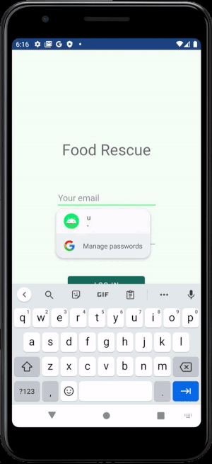
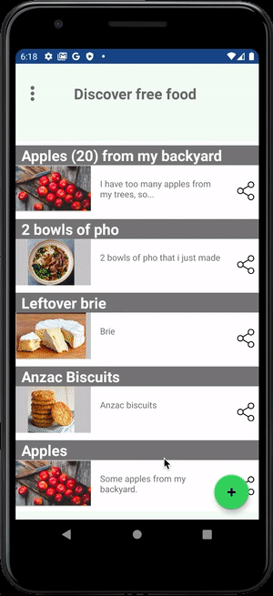
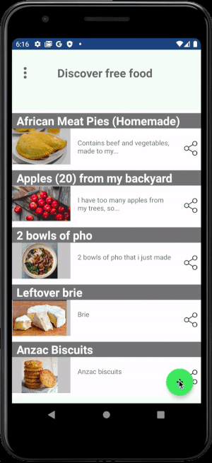
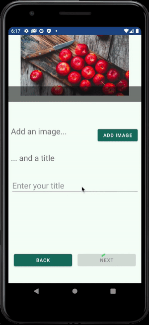

# FoodRescue
This app was developed for SIT305, Mobile App Development during my third year at Deakin University.

The brief was to create an app which would allow users to post food items for collection, ideally to prevent food waste. 
Certain requirements were given in the brief, such as posting Places locations, and integrating a payment system.

## UI Animations

One of my main goals for this project was to create a visually interesting UI that reinforced the user's mental map of the app. To achieve this, I used Android's
transition animations to create transitions which made spatial sense. For example, the transition on the right uses a common element as an anchor. 
\
\
I also created some custom animations which are triggered by various actions. On the left, the two helicopter movements are triggered by the user's input in the username and password fields. They were designed to trigger in this way to give them a more organic timing. Triggering them based on hard coded delays would have given a more mechanical effect.
\
\
\
\
\
\
\
\
\
 
## Image Annotation

My second focus was integrating image annotation using Google Cloud Vision via Firebase. The purpose of this is to provide a tagging system for the food items, which could then be used to filter searches. Using image annotation has the added benefit of a homgenous set of tags, which avoids the problem of misspelled or obscure tags. However, it comes with its own set of problems, such as suggesting irrelevant items as tags, or the possibility that the model completely misidentifies an image. This could be solved by adding a filter to remove any non-food related annotations.
\
\
On the left, we see the user selecting an image. Once an image is chosen, it's sent to Google Cloud vision for annotation. The "Next" button is unavailable 
while the app waits for a response, and by the time the user has entered a title, a response should have beeen received. (NB: this would have to be disabled for
use offline or when signal is poor)
\
\
On the right, we see the resulting tags proposed. Most of them are relevant, although Wood has made it in there. As discussed above, this can be removed by 
filtering out non-food related labels.
\
 
## Future Development
In order to bring the app up to a higher level, the posting/purchasing functionalities would need to be refined - particularly purchasing. Search functions would also be necessary. However, this app was primarily developed for assessment, and may not see further development.
